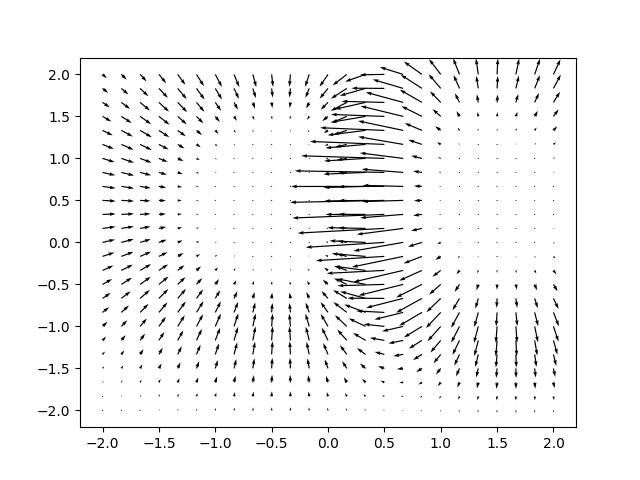

# sk2torch

**sk2torch** converts [scikit-learn](https://scikit-learn.org/) models into [PyTorch](https://pytorch.org/) modules that can be tuned with backpropagation and even compiled as [TorchScript](https://pytorch.org/docs/stable/jit.html).

Problems solved by this project:
 1. scikit-learn cannot perform inference on a GPU. Models like SVMs have a lot to gain from fast GPU primitives, and converting the models to PyTorch gives immediate access to these primitives.
 2. While scikit-learn supports serialization through pickle, saved models [are not reproducible](https://scikit-learn.org/stable/modules/model_persistence.html) across versions of the library. On the other hand, TorchScript provides a convenient, safe way to save a model with its corresponding implementation. The resulting models can be loaded anywhere that PyTorch is installed, even without importing sk2torch.
 3. While certain models like SVMs and linear classifiers are theoretically end-to-end differentiable, scikit-learn provides no mechanism to compute gradients through trained models. PyTorch provides this functionality mostly for free.

See [Usage](#usage) for a high-level example of using the library. See [How it works](#how-it-works) to see which modules are supported.

For fun, here's a vector field produced by differentiating the probability predictions of a two-class SVM (produced by [this script](examples/svm_vector_field.py)):



# Usage

First, train a model with scikit-learn as usual:

```python
from sklearn.linear_model import SGDClassifier
from sklearn.pipeline import Pipeline
from sklearn.preprocessing import StandardScaler

x, y = create_some_dataset()
model = Pipeline([
    ("center", StandardScaler(with_std=False)),
    ("classify", SGDClassifier()),
])
model.fit(x, y)
```

Then call `sk2torch.wrap` on the model to create a PyTorch equivalent:

```python
import sk2torch
import torch

torch_model = sk2torch.wrap(model)
print(torch_model.predict(torch.tensor([[1., 2., 3.]]).double()))
```

You can save a model with TorchScript:

```python
import torch.jit

torch.jit.script(torch_model).save("path.pt")

# ... sk2torch need not be installed to load the model.
loaded_model = torch.jit.load("path.pt")
```

For a full example of training a model and using its PyTorch translation, see [examples/svm_vector_field.py](examples/svm_vector_field.py).

# How it works

**sk2torch** contains PyTorch re-implementations of supported scikit-learn models. For a supported estimator `X`, a class `TorchX` in sk2torch will be able to read the attributes of `X` and convert them to `torch.Tensor` or simple Python types. `TorchX` subclasses `torch.nn.Module` and has a method for each inference API of `X` (e.g. `predict`, `decision_function`, etc.).

Which modules are supported? The easiest way to get an up-to-date list is via the `supported_classes()` function, which returns all `wrap()`able scikit-learn classes:

```
>>> import sk2torch
>>> sk2torch.supported_classes()
[<class 'sklearn.preprocessing._label.LabelBinarizer'>, <class 'sklearn.svm._classes.LinearSVC'>, <class 'sklearn.svm._classes.LinearSVR'>, <class 'sklearn.neural_network._multilayer_perceptron.MLPClassifier'>, <class 'sklearn.kernel_approximation.Nystroem'>, <class 'sklearn.pipeline.Pipeline'>, <class 'sklearn.linear_model._stochastic_gradient.SGDClassifier'>, <class 'sklearn.preprocessing._data.StandardScaler'>, <class 'sklearn.svm._classes.SVC'>, <class 'sklearn.svm._classes.NuSVC'>, <class 'sklearn.svm._classes.SVR'>, <class 'sklearn.svm._classes.NuSVR'>]
```
